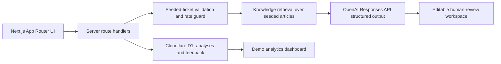

# SupportFlow AI

AI-assisted support triage and escalation demo built with Next.js, TypeScript, Cloudflare Workers, D1 and the OpenAI API. The application analyzes fictional support tickets, retrieves relevant knowledge-base content, drafts grounded customer replies and prepares engineering escalation summaries with human review built into the workflow.

**Portfolio context:** Built by Sajjad M. Rahat as a public demonstration of support workflow design, retrieval-grounded AI assistance and deployable full-stack implementation.

## Problem Addressed

Support teams need to turn incoming issue reports into safe, useful next actions: understand urgency, locate applicable documentation, request missing details and escalate product-impacting cases cleanly. SupportFlow AI demonstrates that workflow without handling real customer information.

All tickets, customer names, organizations and help articles in this repository are fictional SecureDesk sample data. Output is a suggestion for review, never an automatically sent customer response.

## Screenshots

Add portfolio screenshots after deployment:

- Landing page and workflow overview
- Browser extension ticket with a grounded draft reply
- Suspected phishing report with an engineering escalation summary
- Demo analytics dashboard

## Features

- Public landing page with a clear portfolio and fictional-data disclaimer
- Ticket inbox with eight seeded SecureDesk tickets and status/urgency filtering
- Manual `Analyze with AI` workflow; no automatic generation on page load
- Keyword/category retrieval over twelve seeded knowledge articles
- Server-side OpenAI Responses API integration using structured Zod output
- Cited, editable drafted replies labeled for human review
- Escalation decisions and copyable engineering handoff summaries
- Feedback actions stored in Cloudflare D1
- Demo analytics dashboard showing analysis and feedback counts
- API input validation and basic per-client analysis rate protection
- Guided local output path when an OpenAI API key is intentionally not configured

## User Workflow

1. Open `/demo` and choose a fictional ticket.
2. Review the original customer message in the workspace.
3. Click **Analyze with AI**.
4. Inspect triage, urgency, missing information and retrieved articles.
5. Review and edit the drafted response, whose referenced sources are shown visibly.
6. Approve, edit, escalate or mark the suggestion incorrect.
7. View saved demonstration statistics at `/dashboard`.

## Architecture



Retrieval is deliberately simple for the MVP: it scores the bounded seeded article collection with ticket-category and keyword matches. It keeps the project understandable and avoids implying a production vector-search system. A future version could replace this module with embeddings or a managed vector index without changing the review workflow.

## Technology Stack

- Next.js App Router, React and TypeScript
- Tailwind CSS
- OpenAI JavaScript SDK and Responses API structured outputs
- Cloudflare Workers using `@opennextjs/cloudflare`
- Cloudflare D1 with SQL migrations and seed data
- Vitest and Testing Library

## Local Development

Requirements: Node.js 20 or later and a Cloudflare account for D1/Workers operations.

```bash
npm install
cp .env.example .env.local
npm run db:migrate:local
npm run dev
```

Set `OPENAI_API_KEY` in `.env.local` to exercise model generation locally. Without it, the app returns a deterministic **Guided local demo output** based only on seeded documentation and labels that mode in the workspace.

Useful checks:

```bash
npm test
npm run lint
npm run build
```

## D1 Setup And Seeding

The included migrations create `tickets`, `knowledge_articles`, `analyses` and `feedback`, then insert the fictional demo dataset.

1. Authenticate Wrangler:

   ```bash
   npx wrangler login
   ```

2. Create the database:

   ```bash
   npx wrangler d1 create supportflow-db
   ```

3. Replace `REPLACE_WITH_D1_DATABASE_ID` in `wrangler.jsonc` with the returned database ID.

4. Apply seed migrations:

   ```bash
   npm run db:migrate:remote
   ```

For local D1, run `npm run db:migrate:local`. The source dataset is also represented in `src/data/seed.ts` so inbox and bounded retrieval remain deterministic.

## Environment Variables And Secrets

| Variable | Location | Purpose |
| --- | --- | --- |
| `OPENAI_API_KEY` | Cloudflare secret / local `.env.local` | Server-side OpenAI API authentication |
| `OPENAI_MODEL` | Wrangler variable / local env | Structured generation model; defaults to `gpt-4o-mini` |
| `USE_DEMO_AI_FALLBACK` | Local env only | Set `true` to force documented deterministic output during demos/tests |

Configure the production secret without committing it:

```bash
npx wrangler secret put OPENAI_API_KEY
```

No API key is sent to client components. Generation runs in `/api/analyze` only.

## Cloudflare Workers Deployment

This project follows Cloudflare's current Next.js Workers approach through the OpenNext adapter. The checked-in `wrangler.jsonc` configures the Worker output, static assets, Node compatibility, D1 binding and the suggested custom domain `supportflow.sajjadrahat.com`.

After creating D1, applying migrations and storing the OpenAI secret:

```bash
npm run deploy
```

Configure the custom-domain DNS zone in the target Cloudflare account before deploying the route, or remove the `routes` entry temporarily when using a `workers.dev` preview URL.

Official references:

- [Cloudflare Next.js on Workers](https://developers.cloudflare.com/workers/frameworks/framework-guides/nextjs/)
- [OpenNext Cloudflare getting started](https://opennext.js.org/cloudflare/get-started)
- [Cloudflare D1 getting started](https://developers.cloudflare.com/d1/get-started/)
- [OpenAI structured outputs](https://platform.openai.com/docs/guides/structured-outputs?lang=javascript)

## Safety And Privacy Decisions

- The API accepts only one of eight known ticket IDs; custom ticket or prompt submission is intentionally out of scope.
- Every screen identifies the content as fictional sample data.
- Model prompts require procedures to be grounded in retrieved knowledge content.
- When no suitable article exists, the system recommends human review instead of generating unsupported troubleshooting.
- Drafts are editable and visibly marked **AI draft - review before sending**.
- Escalations remain suggestions and require a human feedback action.
- A lightweight in-process limiter protects analysis requests in the MVP. A public production deployment should additionally configure Cloudflare rate limiting and optionally Turnstile.

## Tests

The initial test suite covers:

- Structured triage/API result schema validation
- Knowledge article retrieval ranking
- Escalation decision rendering
- D1 feedback persistence binding behavior

## Future Improvements

- Cloudflare Turnstile and durable distributed rate limits
- Embedding-based retrieval with evaluation fixtures
- Authentication and role-aware review history
- Richer analytics and exportable evaluation data
- Streaming generation and observability
- Integrations with fictional ticket sources for richer demo scenarios

This MVP intentionally excludes real ticket integrations, user-submitted ticket text, automatic emailing and production support claims.
